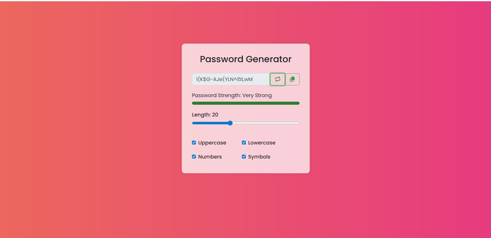

# 🔐 Password Generator

A sleek and smart **Password Generator** built with **HTML, CSS, and JavaScript** — featuring password strength detection, custom options, and live feedback.

---

## 🖼️ Preview

<p align="center">
  
</p>


---

## 🚀 Features

✅ Generate passwords of custom lengths  
✅ Choose to include uppercase, lowercase, numbers, and symbols  
✅ Real-time password strength indicator  
✅ Automatic re-generation for weak/common patterns  
✅ Copy-to-clipboard functionality  
✅ Toast notifications for user feedback  
✅ Clean and responsive UI  

---

## 🧠 Password Strength Logic

The app checks for:
- Length  
- Uppercase & lowercase characters  
- Numbers & symbols  
- Weak/common password patterns (like `password123`, `admin`, etc.)  

If a generated password matches a **weak pattern**, the generator automatically retries until a strong one is created.  

---

## 🧩 Tech Stack

- **HTML5**
- **CSS3**
- **JavaScript (ES6)**

---

## 🖥️ How to Use

1. Clone the repository:
   ```bash
   git clone https://github.com/premkumar127001/Password-Generator.git
2. Open in browser.
    ```bash 
    passwordGenerator.html
---

🤝 Contributing

Contributions are welcome!
If you'd like to improve UI, logic, or features, feel free to fork the repo and submit a PR.

---

📜 License

This project is licensed under the MIT License — feel free to use and modify it.

---

⭐ Support

If you like this project, star the repo ⭐ and share it with your friends!

---